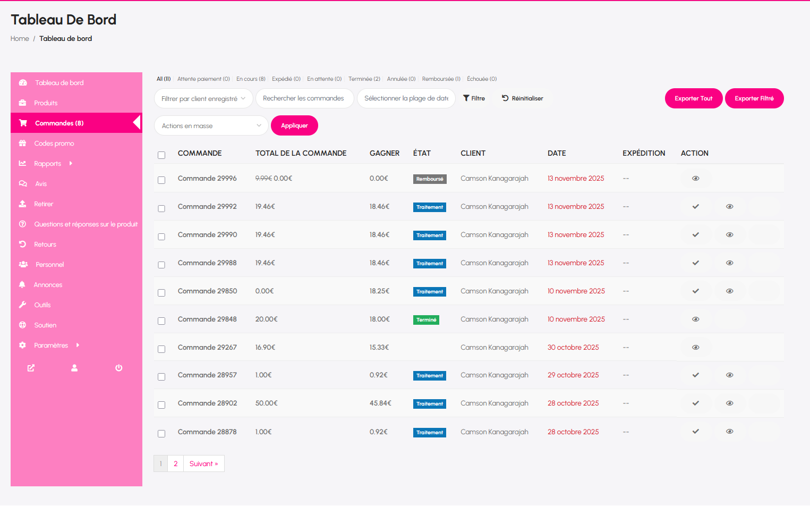

# Gestion des commandes

La gestion des commandes est une fonctionnalité essentielle du tableau de bord vendeur eCamson. Elle permet au vendeur de suivre l’ensemble des achats effectués dans sa boutique, de traiter les commandes, d’enregistrer les expéditions et de gérer les remboursements ou retours si nécessaire.

<figure><figcaption></figcaption></figure>

## **1. Accéder à la liste des commandes**

Dans le menu latéral du tableau de bord, cliquez sur **Commandes**.\
Vous arrivez sur une page affichant toutes les commandes passées dans votre boutique.



L’interface présente :

* Le numéro de commande
* Le total de la commande
* Le gain réel du vendeur
* L’état de la commande
* Les informations du client
* La date de commande
* Le statut d’expédition
* Les actions possibles (voir, traiter, compléter…)

## **2. Filtres disponibles**

<figure><figcaption></figcaption></figure>

En haut de la page, plusieurs filtres permettent d’affiner la recherche :

* **Tous** : affiche toutes les commandes
* **En attente de paiement**
* **En cours de traitement**
* **Expédié**
* **En attente**
* **Terminé**
* **Annulé**
* **Remboursé**
* **Échoué**

Filtres avancés :

* Rechercher une commande
* Filtrer par client
* Sélectionner une plage de dates
* Réinitialiser les filtres

Ces outils facilitent la gestion et la recherche de commandes spécifiques.

***

## La page Détails d'une commande

La page **Détails d’une commande** permet au vendeur d’accéder à toutes les informations relatives à un achat effectué par un client. Depuis cette interface, vous pouvez consulter le contenu exact de la commande, suivre l’état du traitement, gérer l’expédition, appliquer des réductions, ajouter des notes ou modifier le statut de la commande.

Cette section est essentielle pour assurer un suivi professionnel des ventes et améliorer la satisfaction des clients.

### **1. Informations principales de la commande**

<figure><figcaption></figcaption></figure>

La partie supérieure affiche :

* **Numéro de commande**
* **Liste des articles commandés**
* **Coût unitaire**
* **Quantité achetée**
* **Total par produit**

Chaque ligne montre clairement ce que le client a commandé et le montant correspondant.

Sous les articles, les montants additionnels apparaissent :

* **Livraison / mode d’expédition**
* **Réductions éventuelles**
* **Frais d’expédition appliqués**
* **Total de la commande**
* **Montant remboursé** (si applicable)

### **2. Détails généraux**

Sur le panneau de droite, le vendeur peut visualiser les informations globales de la commande :

<figure><figcaption></figcaption></figure>

#### **a) État de la commande**

Exemples :

* **En attente de paiement**
* **En cours**
* **Expédié**
* **En attente**
* **Terminé**
* **Annulé**
* **Remboursé**
* **Échoué**

Il est possible de **modifier le statut** en un clic afin de tenir le client informé de l’évolution.

#### **b) Informations du client**

* Nom
* Email
* Numéro de téléphone
* Adresse IP
* Date et heure de la commande
* Montant du gain vendeur (détaillé après commission)

Une section claire et utile pour contacter le client en cas de besoin.

## **3. Notes de commande**

Les notes permettent de communiquer directement avec le client ou de conserver des remarques internes.

<figure><figcaption></figcaption></figure>

Deux types existent :

* **Notes au client** → visibles pour le client
* **Notes privées** → visibles seulement pour le vendeur

Pour ajouter une note :

1. Écrire un message dans le champ dédié
2. Sélectionner le type de note
3. Cliquer sur **Ajouter une note**

Ces notes apparaissent dans l’historique de la commande et aident à un suivi précis.

## **4. Expéditions**

<figure><figcaption></figcaption></figure>

<figure><figcaption></figcaption></figure>

Si votre boutique gère les expéditions, cette section vous permet de :

* ajouter un numéro de suivi
* notifier le client de l’expédition
* changer le statut vers “Expédié”

Une notification e-mail automatique est envoyée au client dès que vous modifiez l’état.

## **5. Adresses de facturation et de livraison**

<figure><figcaption></figcaption></figure>

La commande affiche séparément :

* **Adresse de facturation** (celle utilisée pour le reçu/facture)
* **Adresse de livraison** (lieu d’expédition du colis)

Ces informations sont modifiables si le client vous signale une erreur avant l’envoi.

## **6. Autorisation de téléchargement de produit (si produit virtuel)**

<figure><figcaption></figcaption></figure>

Si vous vendez un produit numérique :

* vous pouvez contrôler l’accès au téléchargement
* vous pouvez accorder manuellement l’accès en recherchant le fichier
* utile si un client perd son lien ou si une erreur est survenue
